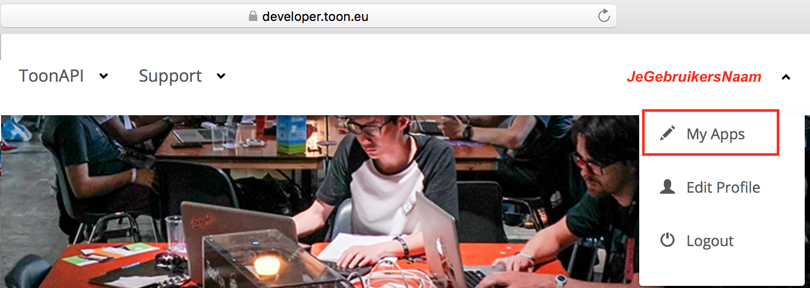
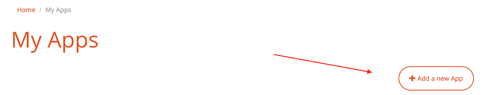
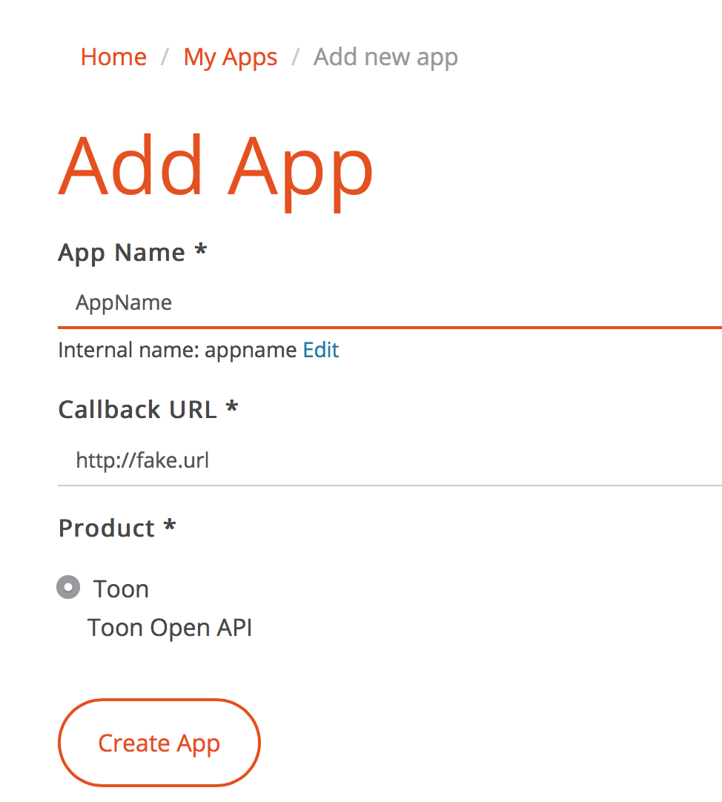
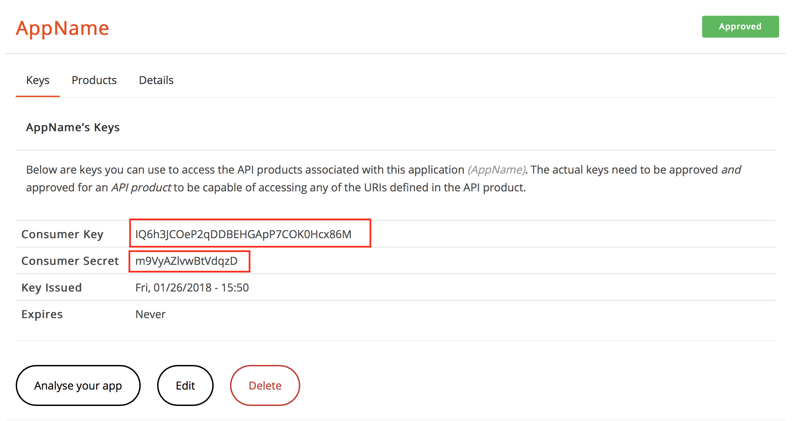

# toontools

toontools is just a python library for connecting to the Toon API and work with your own data.

Since the people of Toon/ Eneco don't like to give you access to your own information, we need to get it ourselves. 
This library contains a Toon connection (ToonAPIv3) and a toontools script that can be used to access toon data/ settings and 
set values to Toon.

This tool connects to Toon, downloads usage data and stores the data in Excel.

Toon export tool: exporteer gebruiksdata van Toon, Toon export naar excel, eneco Toon export usage data, eneco Toon exporteren usage data

## Create API keys
For toontools to work you'll need an account to access the API, this can be created at: https://developer.toon.eu/

after logging in register your app in 
Go to My Apps:

Add new App:

Choose a name and a fake URL:
the URL should be reachable, quick and reply as less info as possible

Get the Consumer Key & Secret:

## Configure toontools
The Consumer Key & Secret are needed in the Python program: place the values in conf/toon.json

## Use Toon Tools
Toontools will create an Excel file in de local directory with the requested usage.
- one Tab per Electricity/ Gas+Interval
- Filename will use Timestamp & Agreement ID
- Request all information at once

## Usage

python toontools/toontools.py --help
python toontools/toontools.py --getusageinter all --getusagestart 2018-01-01
